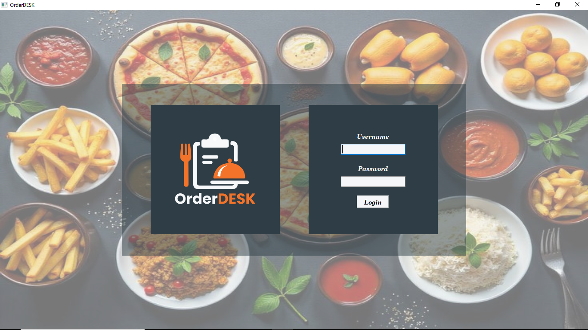
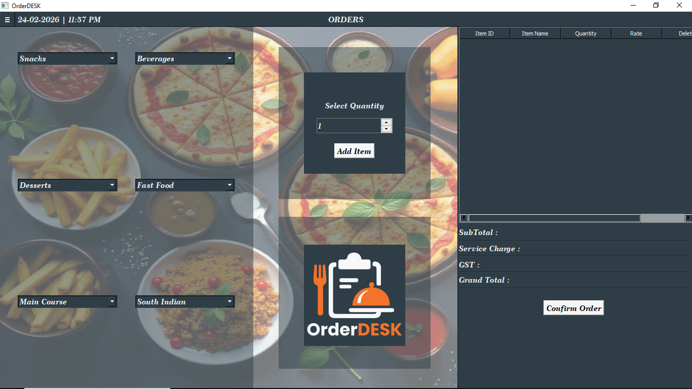
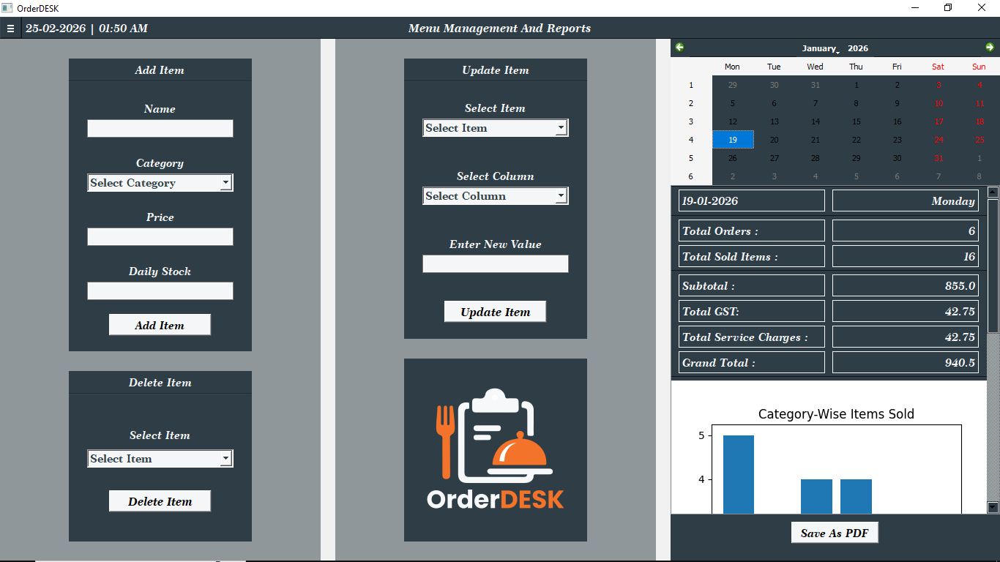

# OrderDESK – Restaurant POS & Management System

## Introduction

OrderDESK is a Python-based restaurant billing and management system built using PyQt5 and SQLite3. 
It simulates real-world restaurant operations including order processing, billing with GST and 
charge calculation, stock management, and sales analytics with graphical reports.

---

## Features

### Cashier
- Select items from multiple categories and add them to the bill
- View bill with Item ID, Name, Rate, Quantity, and Amount
- Delete items from the bill
- Automatically calculate Subtotal, GST, Service Charge, and Grand Total
- Confirm orders to save them and update stock
- View past orders including Order ID, Date, Time, Total Items, and Total Amount

### Manager
- Add, update, and delete menu items
- Monitor daily stock and current stock
- View sales reports and analytics
- Track most sold items and total sales

---

## Tech Stack
- Python 3  
- PyQt5  
- SQLite3  
- Matplotlib
- Datetime  
- ReportLab

---

## Screenshots

### Login Screen

### Cashier Screen

### Manager Screen

## Logo

---

## System Architecture
- Cashier Module  
- Manager Module  
- Order & Billing Engine  
- Stock Management  
- Sales Reports & Analytics  

---

## How to Run
- Clone or download the repository
- Ensure Python 3 is installed
- Install required dependencies: `PyQt5``Matplotlib``ReportLab`
- Ensure the database file is present in the project folder
- Run `login.py`  

---

## Notes
- Daily stock is reset automatically at the start of a new day  
- Full order history is maintained  
- Designed for day-wise restaurant operations (not 24×7)  
- View Orders and Reports are read-only to prevent accidental changes  

---

## Project Purpose
This project was developed as part of an internship/college project to gain hands-on experience with:
- GUI development using PyQt5  
- Database-driven applications with SQLite  
- Real-world billing and management system workflows  
- Stock tracking and analytics for restaurants  

---

## Author
Adesh Prabhune
